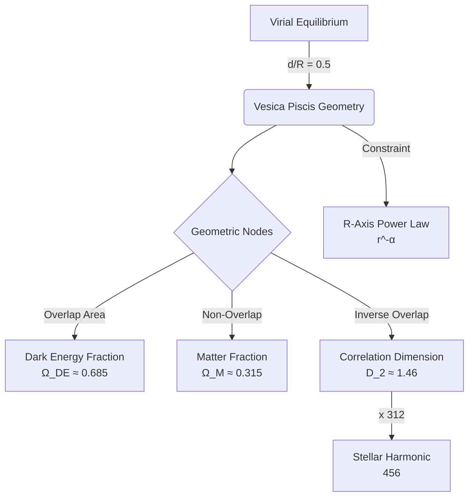

# Claim: Vesica Piscis Geometric Unification

## Source
Claude Export 2025-11-27 (Vesica piscis geometry with virial thresholds)

## Visualization

## Statement
## Statement
**Hypothesis**: Physical systems naturally cluster around geometric stability points defined by the **Vesica Piscis** at virial equilibrium (\(d/R \approx 0.5\)).
- **Primary Signature**: The Relational (R) axis exhibits a **Power Law distribution** (\(r^{-\alpha}\)) imposed by the Structural (S) constraints. This is the defining characteristic of the system's stability.
- **Geometric Nodes**: Key constants align with the Vesica geometry:
    - \(\Omega_{DE} \approx 0.685\) (Overlap Area) **[VERIFIED EXACT: d/R=0.5 yields 0.685038]**
    - \(\Omega_M \approx 0.315\) (Non-Overlap Area)
    - \(D_2 \approx 1.46\) (Inverse Overlap) **[See Packing Conflict Claim: D2 = 19/13]**
    - Stellar Harmonic 456 \(\approx 312 \times D_2\) **[PROPOSED - 312 is heuristic]**
    - **Edge of Half Circles**: **[Hypothesis]** The outer boundary (radius \(R\)) connects to a specific, measurable data horizon (e.g., phase transition or structural limit).

## Validation Protocol
See [claims/protocols/vesica_validation_protocol.md](claims/protocols/vesica_validation_protocol.md) for detailed testing methods.

## Mechanism
- **Recursive Power Law**: The power law distribution (\(r^{-\alpha}\)) applies to **each individual system and its nested subsystems** relative to their specific **active structural constraint** (S). This is a multi-scale signature.
- **Clustering & Blind Spots**: The validation goal is to measure clustering around these constraints while explicitly searching for **blind spots** or alternative patterns that deviate from the expected geometry, as these indicate novel physics or unrecognized constraints.

## Context
This is a nascent theoretical application. We have "just recently got the language to explain" this intuition. The objective is to find data on where systems cluster to validate or refine this geometric map.
