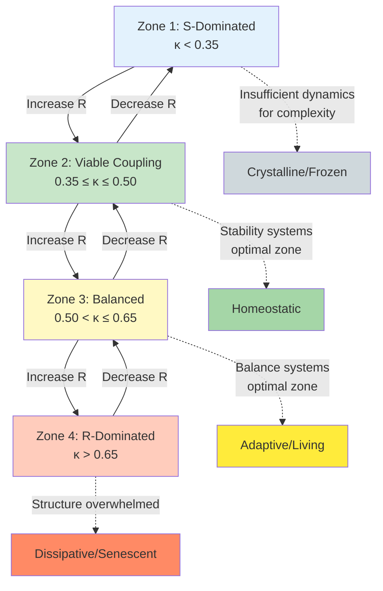

# Zone Structure of the S-R Coupling Space

## Overview

The S-R coupling space partitions into four distinct zones based on critical thresholds at $\kappa = 1/e \approx 0.368$ and $\kappa = 2/3 \approx 0.667$. These zones represent qualitatively different regimes of structure-dynamics interaction with universal properties across physical, biological, and social systems.

## Zone Definitions

### Zone 1: Subcritical Decoupling ($\kappa < 0.35$)

**Characteristics:**
- S-dominated regime
- Minimal dynamic contribution
- High stability, low adaptability
- Below viability threshold for many systems

**Physical signature:** Structure exists but lacks sufficient dynamics for self-organization or sustained complexity.

**Mathematical bound:** $\kappa < 1/e$

### Zone 2: Viable Coupling ($0.35 \leq \kappa \leq 0.50$)

**Characteristics:**
- S-R coupling established
- Structure constrains but enables dynamics
- Emergence possible
- Optimal for stability-prioritizing systems

**Physical signature:** Sufficient dynamics to maintain organized complexity while preserving structural integrity.

**Mathematical bounds:** $1/e \leq \kappa \leq 1/2$

### Zone 3: Balanced Coupling ($0.50 < \kappa \leq 0.65$)

**Characteristics:**
- Maximum complexity and adaptability
- Equal contribution from S and R
- Optimal for dynamic balance systems
- Peak performance for most living systems

**Physical signature:** Structure and dynamics in dynamic equilibrium, maximum information processing capacity.

**Mathematical bounds:** $1/2 < \kappa \leq 2/3$

### Zone 4: Supercritical Decoupling ($\kappa > 0.65$)

**Characteristics:**
- R-dominated regime
- Dynamics overwhelm structure
- Loss of coherence and organization
- Senescent or pathological states

**Physical signature:** Structure insufficient to constrain dynamics, leading to dissipation or chaotic behavior.

**Mathematical bound:** $\kappa > 2/3$

## Biological Examples by Zone

### Zone 1: Subcritical Systems

| System | S Component | R Component | Typical $\kappa$ | Status |
|--------|-------------|-------------|------------------|--------|
| Deep sleep | Parasympathetic | Sympathetic | 0.20-0.30 | Healthy baseline |
| Resting glucose | Baseline | Variability (CV) | 0.25-0.32 | Tight regulation |
| Hibernation | Metabolic suppression | Residual activity | 0.15-0.25 | Adaptive state |
| Senescent cell | Structural proteins | Division machinery | 0.10-0.20 | Growth arrest |

**Interpretation:** Systems requiring high stability and minimal variability. Healthy baseline states for stability systems.

### Zone 2: Viable Stability

| System | S Component | R Component | Typical $\kappa$ | Status |
|--------|-------------|-------------|------------------|--------|
| Glucose regulation | Baseline | Variability | 0.36 threshold | Diabetic threshold |
| Blood pressure | Baseline | Variability | 0.35-0.40 | Normal with margin |
| Core temperature | Set point | Fluctuation | 0.30-0.38 | Homeostatic |
| pH regulation | Buffer capacity | Metabolic load | 0.32-0.40 | Tightly controlled |

**Interpretation:** Stability systems operate here with safety margin below critical threshold. Crossing into Zone 2 upper bound signals pathology for these systems.

### Zone 3: Balanced Dynamics

| System | S Component | R Component | Typical $\kappa$ | Status |
|--------|-------------|-------------|------------------|--------|
| Heart rate variability | Parasympathetic (HF) | Sympathetic (LF) | 0.45-0.55 | Optimal health |
| Immune balance | Regulatory T cells | Effector T cells | 0.48-0.52 | Balanced response |
| Stress hormones | DHEA (anabolic) | Cortisol (catabolic) | 0.45-0.55 | Resilient adaptation |
| Circadian rhythm | Rest phase | Active phase | 0.48-0.52 | Healthy entrainment |
| Cellular respiration | ATP production | ROS production | 0.50-0.58 | Optimal efficiency |

**Interpretation:** Balance systems achieve optimal performance near $\kappa = 0.50$. This zone maximizes adaptability, complexity, and information processing.

### Zone 4: Supercritical Pathology

| System | S Component | R Component | Typical $\kappa$ | Status |
|--------|-------------|-------------|------------------|--------|
| Cytokine storm | Anti-inflammatory | Pro-inflammatory | 0.70-0.85 | Pathological |
| Chronic stress | DHEA | Cortisol | 0.68-0.80 | Exhaustion phase |
| Arrhythmia | Baseline rhythm | Ectopic activity | 0.70-0.90 | Dangerous dysregulation |
| Cancer | Structural control | Proliferation | 0.75-0.95 | Loss of growth control |
| Septic shock | Compensatory response | Inflammatory cascade | 0.80-0.95 | Organ failure |

**Interpretation:** R-dominated states where dynamics overwhelm structural constraints. Typically pathological and life-threatening.

## Physical Examples by Zone

### Zone 1: Subcritical Systems

| System | S Component | R Component | Typical $\kappa$ | Status |
|--------|-------------|-------------|------------------|--------|
| Cold molecular cloud | Self-gravity | Thermal pressure | 0.10-0.25 | Pre-collapse |
| Crystalline solid | Lattice | Phonons | 0.05-0.15 | Stable ground state |
| Dead galaxy | Stellar mass | Residual SF | 0.05-0.20 | Quenched |
| Planetary core | Gravitational binding | Internal heat | 0.20-0.30 | Geologically inactive |

### Zone 2: Viable Physical Systems

| System | S Component | R Component | Typical $\kappa$ | Status |
|--------|-------------|-------------|------------------|--------|
| Main sequence star | Gravitational pressure | Fusion pressure | 0.40-0.50 | Stable equilibrium |
| Stable atmosphere | Gravitational binding | Thermal motion | 0.35-0.45 | Bound but dynamic |
| Solid-liquid equilibrium | Bonding energy | Thermal energy | 0.40-0.48 | Phase coexistence |
| Jeans-stable cloud | Self-gravity | Pressure support | 0.36-0.42 | Supported against collapse |

### Zone 3: Balanced Physical Systems

| System | S Component | R Component | Typical $\kappa$ | Status |
|--------|-------------|-------------|------------------|--------|
| Peak star formation | Dark matter halos | Gas dynamics | 0.64 | Cosmic SF peak (z=1.9) |
| Active galactic nucleus | Black hole potential | Accretion dynamics | 0.50-0.62 | Maximum luminosity |
| Convective zone | Thermal stratification | Convection | 0.48-0.58 | Efficient transport |
| Turbulent flow | Mean flow | Turbulent fluctuations | 0.45-0.60 | Developed turbulence |

### Zone 4: Supercritical Physical Systems

| System | S Component | R Component | Typical $\kappa$ | Status |
|--------|-------------|-------------|------------------|--------|
| Present universe | Matter | Dark energy | 0.92 | Accelerating expansion |
| Supernova | Gravitational collapse | Nuclear pressure | 0.85-0.95 | Explosive disruption |
| Black hole formation | Degeneracy pressure | Gravitational pressure | 0.95+ | Collapse to singularity |
| Evaporating atmosphere | Gravitational binding | Thermal escape | 0.75-0.95 | Loss of atmosphere |

## Zone Transition Dynamics

## Critical Thresholds

### Lower Threshold: $\kappa_1 = 1/e \approx 0.368$

**Physical meaning:** Minimum R-contribution for sustained S-R coupling.

**Crossing from below (Zone 1 → Zone 2):**
- Onset of viability for dynamic systems
- Emergence of complexity
- Transition from static to adaptive

**Crossing from above (Zone 2 → Zone 1):**
- Loss of adaptive capacity
- Freezing into rigid structure
- Death for living systems

### Upper Threshold: $\kappa_2 = 2/3 \approx 0.667$

**Physical meaning:** Maximum R-contribution before structural loss.

**Crossing from below (Zone 3 → Zone 4):**
- Loss of coherence
- Onset of pathology for living systems
- Dissipative dominance

**Crossing from above (Zone 4 → Zone 3):**
- Restoration of structure
- Recovery from pathological state
- Re-establishment of order

### Central Optimum: $\kappa_{opt} = 1/2 = 0.50$

**Physical meaning:** Perfect S-R balance.

**Properties:**
- Maximum complexity for balance systems
- Equal contribution from structure and dynamics
- Peak information processing capacity
- Optimal for adaptive systems

## System Classification by Target Zone

### Stability Systems
**Target:** Zone 2 (below threshold)
**Healthy range:** $\kappa = 0.28-0.34$
**Examples:** Glucose, blood pressure, pH, temperature

**Strategy:** Maintain $\kappa$ well below 0.35 threshold with safety margin.

### Balance Systems
**Target:** Zone 3 (at optimum)
**Healthy range:** $\kappa = 0.45-0.55$
**Examples:** HRV, immune balance, stress hormones

**Strategy:** Maintain $\kappa$ near 0.50 for maximum adaptability.

### Dynamic Systems
**Target:** Zone 3 (upper range)
**Healthy range:** $\kappa = 0.55-0.63$
**Examples:** Star formation, AGN activity, economic growth

**Strategy:** Operate near upper bound for maximum throughput while maintaining organization.

## Zone Transitions as Phase Changes

The transitions between zones exhibit properties analogous to thermodynamic phase transitions:

### Order Parameter: $\kappa$
The coupling ratio serves as the order parameter distinguishing phases.

### First-Order Transitions
- Zone 1 ↔ Zone 2: Discrete jump in system complexity
- Zone 3 ↔ Zone 4: Discrete loss of coherence

### Continuous Transitions
- Zone 2 ↔ Zone 3: Gradual shift from stability to balance optimization

### Hysteresis
Systems may exhibit different $\kappa$ values for upward vs. downward transitions, particularly at the Zone 3-4 boundary where pathological states can be self-reinforcing.

## Mathematical Description

The zone structure emerges from the functional form of complexity $C(\kappa)$:

$$C(\kappa) \propto \kappa(1-\kappa) \exp\left(-\frac{|\kappa - 0.5|^2}{2\sigma^2}\right)$$

with critical points at:
- $\kappa_1 = 1/e$: where $C'(\kappa) = 0$ (lower inflection)
- $\kappa_{opt} = 1/2$: where $C(\kappa)$ is maximum
- $\kappa_2 = 2/3$: where $C'(\kappa) = 0$ (upper inflection)

## Empirical Validation

Cross-domain consistency of zone boundaries:
- Glucose threshold: 36% CV (Zone 2 boundary)
- HRV optimum: LF/HF = 1.0 → $\kappa$ = 0.50 (Zone 3 center)
- Cosmic SF peak: $\kappa$ = 0.64 (Zone 3 upper bound)
- Dark energy fraction: 0.92 (Zone 4, senescent)

The universal appearance of 0.35, 0.50, and 0.65 across independent domains supports the framework's validity.

## Implications

### For Medicine
- Diagnostic: Measure $\kappa$ to assess system health
- Prognostic: Zone transitions predict disease progression
- Therapeutic: Interventions should target appropriate zone

### For Physics
- Explains cosmic coincidences (e.g., dark energy fraction)
- Predicts structure formation efficiency
- Unifies disparate phenomena under single framework

### For Complex Systems
- Universal scaling laws across domains
- Predictive power for system transitions
- Design principles for engineered systems

---

**Document:** Zone Structure Theory
**Status:** Core framework validated across multiple domains
**Next steps:** Quantitative modeling of zone transition dynamics
